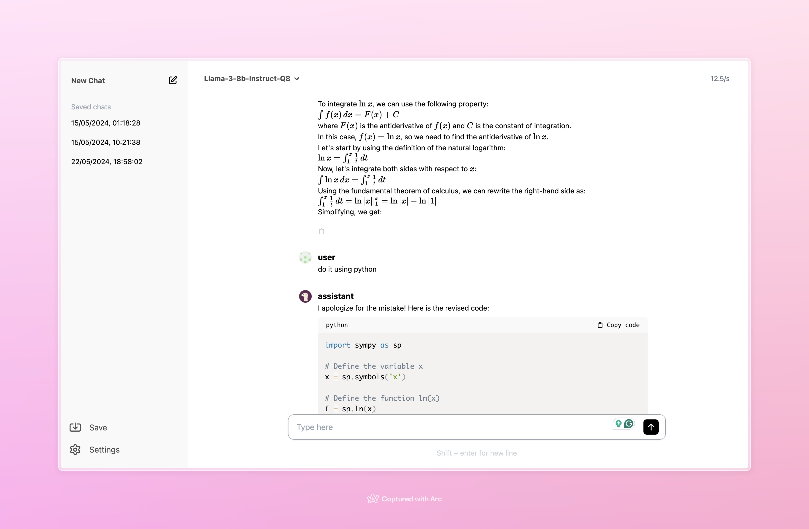

# MLX Web UI

Hello, this repo is an easy way to run a web server for MLX. The design is very minimalistic and contains multiple features like:

- Support for Latex and code formatting (allows to copy the code snippet )
- Ability to set model params (top p, temp, role mapping...)
- Ability to set default params
- Install model from Web server itself
- Save previous conversations and load from there
- Copy response through a button 
- Chat with models, stop conversation
- Swap models easily

And more coming soon like:

- [ ] Multi-model support
- [ ] RAG and knowledge graph support (chat with large documents )


Here is photo of the UI



## Installation

No pre-requisites or dependencies needed.

You would only need to run this command to install:

```bash
sudo bash -c "$(curl -s https://raw.githubusercontent.com/Rehan-shah/mlx-web-ui/main/install.sh)"
```

## Getting Started

After installation, navigate to the `mlx-web-ui` directory:

```
cd mlx-web-ui
```

To start the server, run:

```
sudo bash main.sh
```

This will start the web server on `http://localhost:5173`. Open your web browser and navigate to `http://localhost:5173` to access the MLX Web UI.

